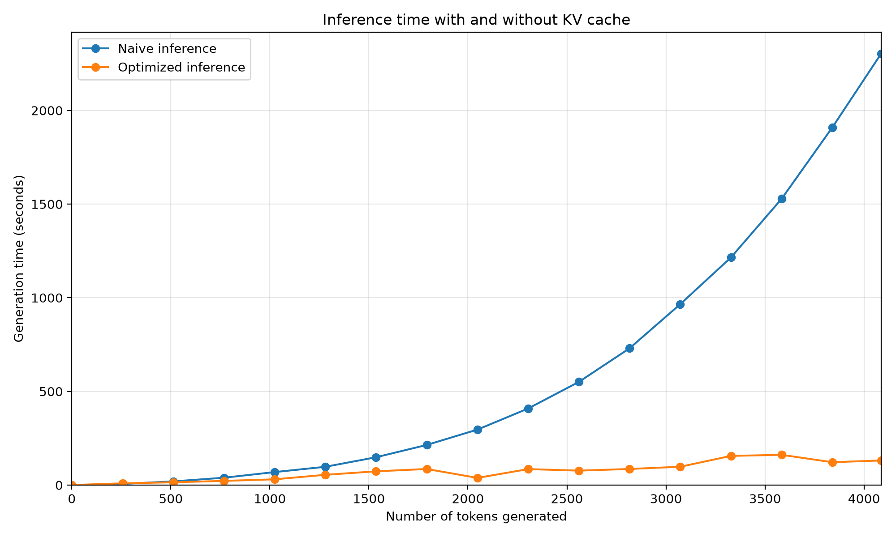

# LLM From Scratch

Small decoder-only Transformer implemented in PyTorch, trained from scratch to generate Yu-Gi-Oh cards. The decoder architecture is based on [Attention Is All You Need](https://arxiv.org/abs/1706.03762).

## Folders

- `src/llm_from_scratch/`: model, inference engine, tokenizer, dataset, and checkpoint code.
- `scripts/`: runnable scripts for data prep, training, and inference.
- `data/`: raw and processed datasets.
- `model/`: saved training runs and checkpoints.

## Setup

```bash
uv sync
```

Optional W&B logging:

```bash
uv run wandb login
```

Set `use_wandb=True`, `wandb_entity`, and `wandb_project` in `scripts/train.py` to enable logging. Training and model settings live in `TRAIN_CONFIG` and `MODEL_CONFIG`.

## How to train a new model

Run in order:

```bash
uv run scripts/download_data.py
uv run scripts/create_dataset.py
uv run scripts/build_tokenizer.py
uv run scripts/train.py
uv run scripts/inference.py
uv run scripts/open_pack.py
```

- `download_data.py`: downloads the raw Yu-Gi-Oh card dataset.
- `create_dataset.py`: converts raw card rows into train/validation text files.
- `build_tokenizer.py`: builds the char and BPE tokenizers.
- `train.py`: trains the Transformer and writes checkpoints to `model/`.
- `inference.py`: loads a checkpoint and generates card text.
- `open_pack.py`: opens a booster pack of generated cards from your CLI :).

Use `checkpoint.pt` to resume training and `best_model.pt` for inference.


### Sample card pack 

```bash
Press Enter to reveal card 1/5...

+--------------------------------------------------------------------------------+
| CARD 1/5                                                                COMMON |
|                                Oracle Of Light                                 |
+--------------------------------------------------------------------------------+
| type: monster                                                                  |
| sub_type: [fairy／effect]                                                       |
| attribute: light                                                               |
| rank: level 4                                                                  |
| attack: 0                                                                      |
| defense: 2000                                                                  |
| description: if your opponent controls a monster, you can special summon this  |
| card (from your hand). if this card is normal or special summoned from the     |
| hand: you can draw 1 card. during your main phase: you can activate this       |
| effect; you can add 1 level 4 or lower light fairy monster from your gy to     |
| your hand, except "contorteration". you can only use each effect of "tis the   |
| dragon ninja" once per turn.                                                   |
+--------------------------------------------------------------------------------+

Press Enter to reveal card 2/5...

+--------------------------------------------------------------------------------+
| CARD 2/5                                                                COMMON |
|                          Neo Blue Carrier Fuborawler                           |
+--------------------------------------------------------------------------------+
| type: monster                                                                  |
| sub_type: [insect／effect]                                                      |
| attribute: light                                                               |
| rank: level 5                                                                  |
| attack: 1700                                                                   |
| defense: 1200                                                                  |
| description: you can special summon this card (from your hand) by tributing 1  |
| insect or plant monster, except "insect armor ninja getsuga". if this card is  |
| special summoned from the gy: you can special summon 1 level 4 or lower insect |
| monster from your hand. you can only special summon "assaraiza the hidden      |
| star" once per turn this way. if this card in its owner's control is destroyed |
| by an opponent's card (by battle or card effect): you can target 1 level 4 or  |
| lower insect monster in your gy; add it to your hand. you can only use this    |
| effect of "nimble darklord" once per turn.                                     |
+--------------------------------------------------------------------------------+

Press Enter to reveal card 3/5...

+--------------------------------------------------------------------------------+
| CARD 3/5                                                            ULTRA RARE |
|                           Wishes Of The White Forest                           |
+--------------------------------------------------------------------------------+
| type: monster                                                                  |
| sub_type: [illusion／effect]                                                    |
| attribute: light                                                               |
| rank: level 3                                                                  |
| attack: 300                                                                    |
| defense: 1200                                                                  |
| description: (quick effect): you can tribute this card; special summon 1       |
| "white forest" monster from your deck, by tributing monsters from your hand or |
| field whose total levels equal 8 or more. you can only use each effect of      |
| "white steuder" once per turn. each time a spell card is activated, place 1    |
| spell counter on this card when that spell resolves.                           |
+--------------------------------------------------------------------------------+
Pack Summary
------------
1. Common             oracle of light
2. Common             neo blue carrier fuborawler
3. Ultra Rare         wishes of the white forest
```

## Inference Engine (WIP)

I started implementing an inference engine for this model in `llm-from-scratch/src/llm_from_scratch/engine.py`.

The goal is to:
1. Learn how inference engines work
2. Speed up inference of my model

### Architecture

```text
generate()
    ↓
add_request()
    ↓
Scheduler
    ├── WAITING
    ├── PREFILLING
    ├── DECODING
    └── FINISHED
    ↓
Transformer
    ↓
Per-request contiguous KV cache
```

`generate()` is a blocking convenience API over the request-oriented `add_request()` and `step()` methods. Cached requests currently run sequentially with an independent contiguous KV cache; tensor batching is planned.

### Current speedups

#### KV-Cache

Caching the outputs of the K and V projection matrices for past tokens speeds up inference because they do not have to be recomputed during every decode step.


I derived the FLOP counts for predicting one new token with and without a KV cache. The complete derivation is available as a [PDF](docs/inference-arithmetic/transformer-inference-arithmetic.pdf) or as [LaTeX source](docs/inference-arithmetic/transformer-inference-arithmetic.tex).

Without a KV cache, we process the full context again:

```text
FLOPs_no_cache =
    BTC
    + 8LBTC²
    + 4LBCT²
    + 4LBTC·FF_C
    + 2BTCV
```

With a KV cache, we process only the new token and reuse the keys and values of the previous tokens:

```text
FLOPs_KV_cache =
    BC
    + 8LBC²
    + 4LBCT
    + 4LBC·FF_C
    + 2BCV
```

The attention term changes from `4LBCT²` to `4LBCT`. For one decode step, attention therefore scales linearly instead of quadratically with the current context length.

For my model with a batch size of 1 and a context length of 4096, my idealized roofline calculation gives an arithmetic intensity of approximately **3109.94 FLOPs/byte for prefill** and **0.50 FLOPs/byte for decode**. Which confirms that prefill is compute-bound while decode is memory-bound.

However the cache uses additional memory:

```text
KV bytes per token = 2 × n_layers × n_heads × d_head × bytes_per_element
```

Which can quickly make the KV cache grow into the Gigabytes.

### Experiment

I compared greedy generation with and without the KV cache, using the median of three runs for each sequence length. The benchmark used an empty user prompt and the following configuration:

```text
Model: 8 layers, d_model=1024, 8 heads, d_ff=4096, context=4096
Tokenizer: BPE, vocabulary size 4096
Device: Apple MPS
Dtype: float32
```

At 4086 generated tokens, generation took 2302.6 seconds without caching and 131.2 seconds with caching: a **17.55× speedup**. See the [benchmark script](scripts/benchmark_inference_engine.py) and [raw results](data/benchmarks/inference_benchmark_kv/results.csv).

| Tokens | Naive | KV cache | Throughput improvement |
|---:|---:|---:|---:|
| 256 | 6.1s | 9.2s | -33% |
| 512 | 19.5s | 14.7s | +33% |
| 768 | 39.1s | 22.1s | +77% |
| 1024 | 69.2s | 30.6s | +126% |
| 1280 | 97.4s | 54.6s | +78% |
| 1536 | 148.4s | 73.2s | +103% |
| 1792 | 214.1s | 85.7s | +150% |
| 2048 | 296.0s | 38.1s | +676% |
| 2304 | 408.6s | 85.1s | +380% |
| 2560 | 550.6s | 77.0s | +615% |
| 2816 | 729.9s | 85.7s | +751% |
| 3072 | 965.6s | 97.7s | +889% |
| 3328 | 1215.0s | 155.6s | +681% |
| 3584 | 1528.3s | 161.3s | +848% |
| 3840 | 1909.3s | 121.9s | +1467% |
| 4086 | 2302.6s | 131.2s | +1655% |



Interestingly only at 512 tokens does the KV Cache seem to overcome it's added overhead. It's a bit strange how we even seem to generate more tokens in less time with the KV-cache so itseems my MPS runtime wasn't as consistent. Neverthless the benefits are clear over the naive approach.

### Inference Engine Roadmap

| Feature | Status |
|---|---|
| Separate prefill and decode stages | Implemented |
| Contiguous KV cache | Implemented |
| Request scheduler | Implemented |
| Gather-based paged-attention demo | Implemented |
| Tensor request batching | Planned |
| Continuous batching | Planned |
| Prefix caching | Future |
| Speculative decoding | Future |
| Beam search | Future |

The paged-attention demo gathers blocks into contiguous tensors before running ordinary PyTorch attention. Production implementations instead use specialized kernels that read from block tables directly.

